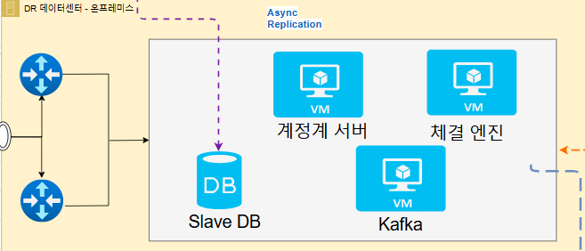

# 🏢 MaeSoonGan On-Prem Main Server

## ✍️ 프로젝트 한 줄 소개

* 한국 금융권 이중 IDC 규제를 반영한 모의투자 서비스에서, 주센터 장애 발생 시 계정계(체결엔진·원장시스템)와 DB 서비스를 복구하기 위한 On-Premise DR 센터 서버입니다. Veeam 기반 VM 복제, DR DB 승격, ProxySQL 단일 엔드포인트 전환, Kafka DR 구성을 통해 장애 상황에서도 거래 처리 연속성과 데이터 정합성을 확보합니다.

 

## 🛫 레포지토리 개요

* 이 레포지토리는 MaeSoonGan 프로젝트의 **DR 센터(DR Center) 서버** 구축 및 운영 문서를 관리합니다.

* DR 센터는 주센터(Main Center) 장애 상황에 대비하여 계정계(체결엔진·원장시스템)를 복구하기 위한 On-Premise 대기 환경입니다. 금융권 계정계는 데이터 정합성과 서비스 연속성이 중요하기 때문에, 주센터에 장애가 발생하더라도 거래 핵심 기능을 복구할 수 있도록 별도의 DR 서버를 구성했습니다.

* 주센터의 계정계 서버와 체결 엔진 VM은 Veeam Replication을 통해 DR 서버로 복제되며, 장애 발생 시 DR 서버에서 Replica VM을 실행하여 원장 시스템과 체결 엔진을 복구할 수 있습니다. 또한 DR DB는 Main DB Cluster의 장애 조치 대상에 포함되어 있으며, Orchestrator가 Master 장애를 감지하면 DR DB를 새로운 Master로 승격할 수 있도록 구성했습니다.

* 애플리케이션은 DB에 직접 접속하지 않고 ProxySQL의 단일 엔드포인트를 통해 접속합니다. 따라서 Master DB가 Main 서버에서 DR 서버로 변경되더라도, 애플리케이션은 동일한 DB 접속 경로를 유지하고 ProxySQL이 내부적으로 새로운 Master로 라우팅합니다. Kafka 역시 DR 환경에 별도로 구성하여, Main 장애 이후에도 주문·체결 이벤트 흐름을 이어갈 수 있도록 했습니다.

 

## 📋 목차

### DR 인프라 / 네트워크

* [DR 서버 네트워크 및 라우팅 구성](./dr-network.md)

### Veeam Replication / VM DR

* [Veeam Replication 구성](./veeam-replication.md)

### DR DB / Failover

* [Orchestrator·ProxySQL 기반 DB Failover](./db-failover.md)

### 장애 복구 시나리오 / 검증

* [DR 전환 테스트 및 체크리스트](./recovery/dr-failover-test.md)

 

## 🏗️ DR 센터 서버 아키텍처

 

## 🧩 구성 요소

| 구성 요소             | 역할                                                  |
| ----------------- | --------------------------------------------------- |
| VyOS Router       | DR 서버 내 VLAN 간 내부 라우팅 및 DR 네트워크 연결                  |
| Veeam VM          | 주센터 VM 복제 및 DR Failover 관리                          |
| 계정계 서버 Replica    | 주센터 원장시스템 VM 복제본, 장애 시 DR 환경에서 기동                   |
| 체결 엔진 Replica     | 주센터 체결 엔진 VM 복제본, 장애 시 주문 체결 처리 복구                  |
| Kafka             | DR 환경의 주문·체결 이벤트 스트리밍                               |
| DR MySQL DB       | Main DB 장애 시 Master 승격 대상이 되는 DR 데이터베이스             |
| Orchestrator      | Main/DR DB 토폴로지 관리 및 장애 시 DR DB 승격                  |
| ProxySQL          | 단일 DB 엔드포인트 제공, Master 변경 시 접속 경로 전환                |
| Veeam Replication | 주센터 계정계·체결 엔진 VM을 DR 서버로 복제                         |
| Failover Script   | DR VM 기동 후 IP, Gateway, DNS, Hostname 등 네트워크 전환 자동화 |
| Kafka DR          | Main 장애 이후에도 이벤트 기반 주문·체결 흐름 유지                     |

 

## 📡 주요 구성 영역

### DR VM Cluster

* Veeam VM — 주센터 VM 복제 및 Failover 관리
* 계정계 서버 Replica — 원장시스템 복구용 VM
* 체결 엔진 Replica — 주문 체결 처리 복구용 VM
* Failover Script — DR VM 기동 후 네트워크 정보 자동 전환

### DR DB Cluster

* DR MySQL DB — Main Master 장애 시 승격 가능한 DB 노드
* Orchestrator — Master 장애 감지 및 DR DB 승격
* ProxySQL — 단일 엔드포인트 기반 DB 접속 경로 전환

### Kafka DR

* Kafka — DR 환경의 주문·체결 이벤트 처리
* 주문 이벤트 스트리밍 — 장애 이후에도 비동기 이벤트 흐름 유지
* 체결 결과 이벤트 전달 — 복구된 계정계·체결 엔진과 연동

 

## 🔁 데이터 흐름

1. 평상시에는 주센터(Main Center)의 계정계 서버와 체결 엔진이 거래 처리를 담당합니다.
2. 주센터의 계정계 서버와 체결 엔진 VM은 Veeam Replication을 통해 DR 서버로 복제됩니다.
3. Main DB의 데이터는 복제 구성을 통해 DR DB까지 동기화되며, DR DB는 장애 조치 대상에 포함됩니다.
4. 애플리케이션은 DB에 직접 접속하지 않고 ProxySQL의 단일 엔드포인트를 통해 DB에 접근합니다.
5. Orchestrator는 Main Master DB 상태를 지속적으로 감시합니다.
6. Main Master DB 장애가 발생하면 Orchestrator가 장애를 감지하고, DR DB를 새로운 Master로 승격합니다.
7. ProxySQL은 변경된 Master 정보를 반영하여 애플리케이션의 DB 접속 경로를 DR DB로 전환합니다.
8. 주센터의 계정계 또는 체결 엔진 VM 장애 시 Veeam Failover를 통해 DR 서버의 Replica VM을 기동합니다.
9. DR VM 기동 후 Failover Script를 통해 IP, Gateway, DNS, Hostname 등 네트워크 설정을 DR 환경에 맞게 변경합니다.
10. DR Kafka는 주문·체결 이벤트 흐름을 이어받아, 복구된 계정계 서버와 체결 엔진이 이벤트 기반 처리를 계속 수행할 수 있도록 합니다.
11. 이를 통해 Main 서버 장애 상황에서도 DR 서버를 통해 계정계, 체결 엔진, DB, Kafka 기반 이벤트 처리를 복구할 수 있습니다.

 

## 🖥️ 서버 사양

| 구분         | 내용             |
| ---------- | ----------------- |
| Hypervisor | VMware ESXi 7.0U3 |
| OS         | ESXi              |
| vCPU       | 16                |
| RAM        | 20GB              |
| Disk       | 250GB             |

 